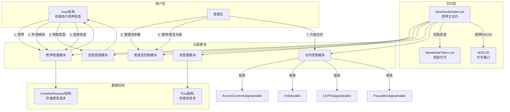
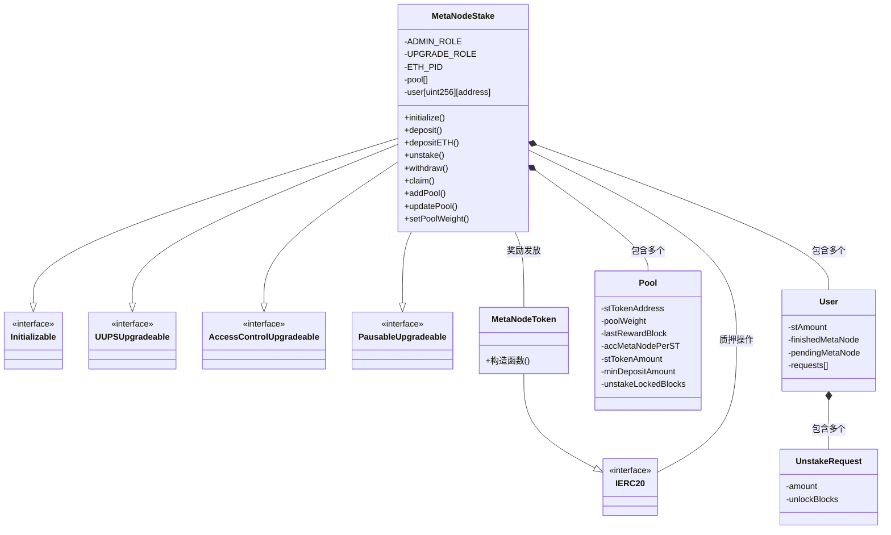
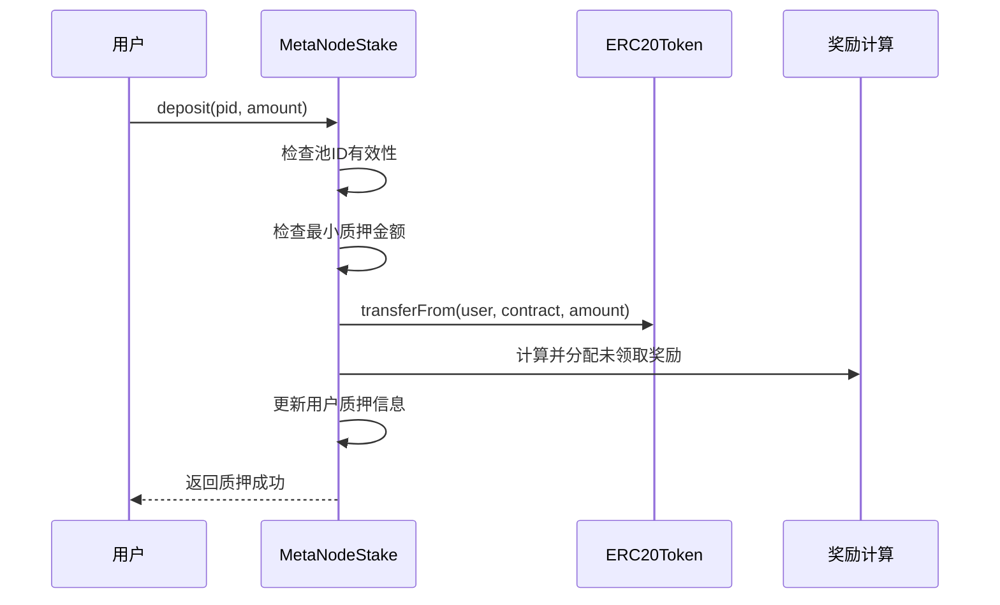
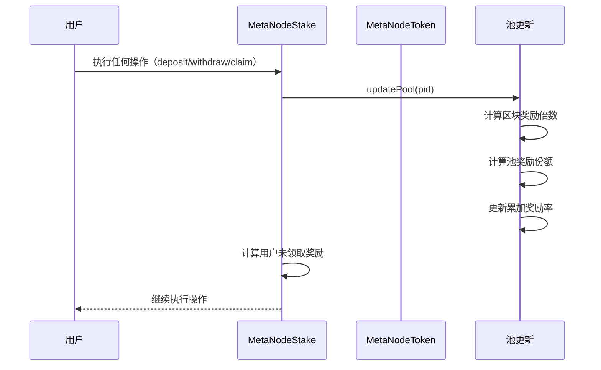
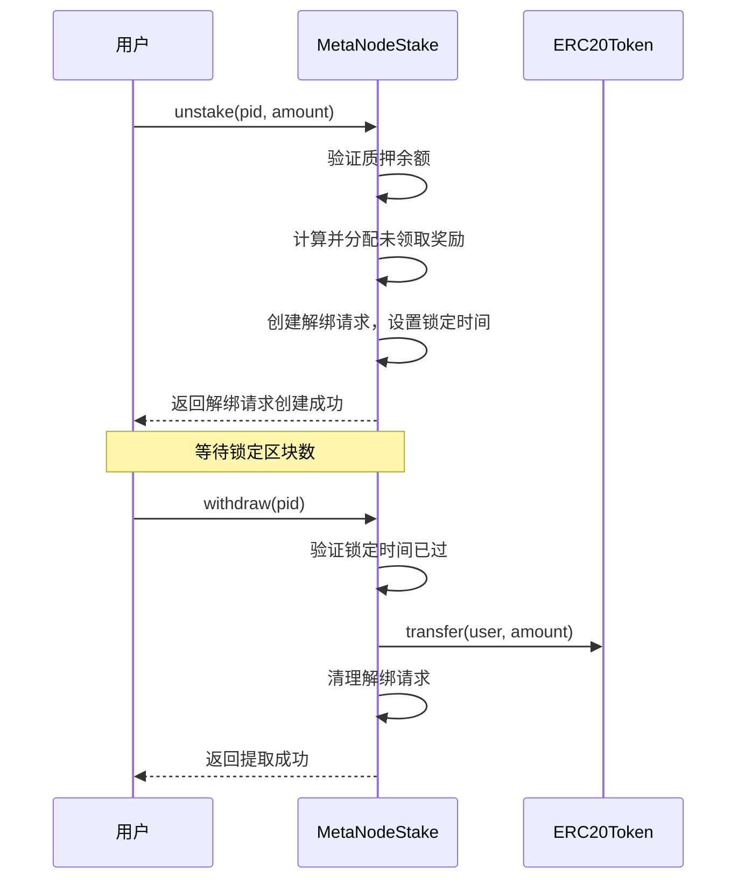

# MetaNodeStake 项目架构图

## 项目概述

MetaNodeStake 是一个基于以太坊的多池质押系统，支持用户质押 ETH 或 ERC20 代币，并根据质押时间和数量获取 MetaNode 代币奖励。系统采用可升级合约设计，具有基于角色的访问控制和灵活的质押参数配置功能。

## 系统架构图

## 合约关系

## 主要功能流程

### 1. 质押流程

### 2. 奖励分配流程

### 3. 解绑和提取流程

## 核心模块详解

### 1. 池管理模块
- 支持多池质押，第一个池固定为ETH池
- 每个池有独立的权重、最小质押金额、锁定区块数等参数
- 管理员可以动态调整池参数和权重

### 2. 质押管理模块
- 支持ETH和ERC20代币质押
- 实现质押、解绑申请、提取功能
- 解绑有锁定机制，需等待指定区块数后才能提取

### 3. 奖励管理模块
- 基于区块产出MetaNode奖励
- 按池权重分配奖励
- 实时计算用户未领取奖励
- 支持奖励领取功能

### 4. 管理员控制模块
- 角色管理：ADMIN_ROLE和UPGRADE_ROLE
- 功能暂停/恢复：提现和领取奖励
- 参数调整：开始区块、结束区块、区块奖励等

### 5. 访问控制模块
- 基于OpenZeppelin的AccessControlUpgradeable实现角色控制
- 基于UUPSUpgradeable实现合约可升级
- 基于PausableUpgradeable实现功能暂停
